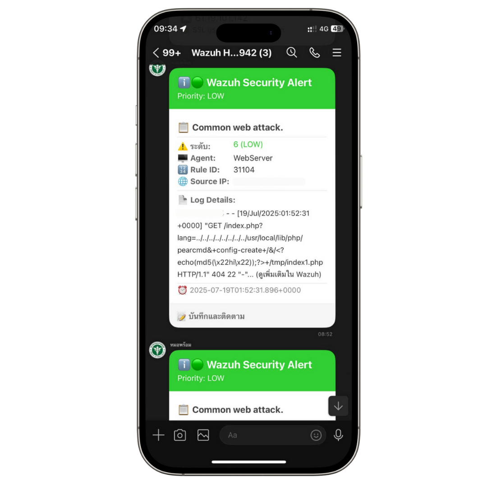
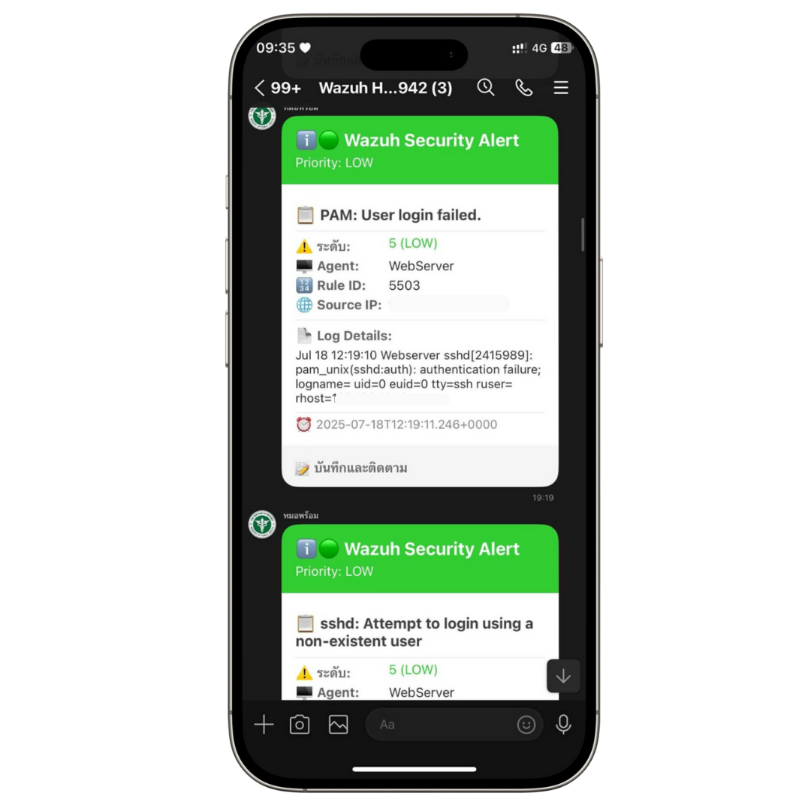

# Wazuh MOPH Notify Integration

🚨 **Wazuh Security Alert Integration สำหรับ LINE OA หมอพร้อม ผ่าน MOPH Notify API**

[](https://github.com/yourusername/wazuh-moph-notify)
[](https://www.python.org/)
[](LICENSE)
[](https://developers.line.biz/en/docs/messaging-api/flex-message-elements/)

## 📋 ภาพรวม

Integration นี้จะส่ง Security Alert จาก Wazuh SIEM ไปยัง LINE OA หมอพร้อม ผ่าน MOPH Notify API โดยใช้ LINE Flex Message ที่สวยงามและแสดงข้อมูลครบถ้วน

### ✨ คุณสมบัติหลัก

- 🎨 **Flex Message สวยงาม** - Header, Body, Footer แบบ responsive
- 🚦 **แยกสีตาม Priority** - CRITICAL(แดงเข้ม), HIGH(แดง), MEDIUM(ส้ม), LOW(เขียว), INFO(น้ำเงิน)
- 📊 **แสดงข้อมูลตาม Level** - Level สูง (≥10) แสดงข้อมูลเพิ่มเติม, Level ต่ำแสดงข้อมูลพื้นฐาน
- ✂️ **Auto-truncate** - ตัดข้อความยาวอย่างฉลาด
- 🛡️ **Error Handling ครบถ้วน** - ตรวจสอบ connection, timeout, JSON format
- 🔧 **Production Ready** - รองรับ UAT และ Production environment

### 📸 ตัวอย่างการแสดงผล

```
🚨🔴 Wazuh Security Alert
Priority: HIGH

📋 Multiple authentication failures from same source IP
⚠️ ระดับ: 12 (HIGH)
🖥️ Agent: web-server-01  
🔢 Rule ID: 5712
🌐 Source IP: 192.168.1.100

📄 Log Details:
Dec 18 10:30:00 web-server-01 sshd[1234]: Failed password for admin...

⏰ 2025-07-18T10:30:00.000+0000

🚀 ดำเนินการด่วนภายใน 15 นาทีี



```

## 🚀 การติดตั้งด่วน

### 1. ดาวน์โหลดไฟล์
```bash
# ดาวน์โหลด repository
git clone https://github.com/yourusername/wazuh-moph-notify.git
cd wazuh-moph-notify

# คัดลอกไฟล์ไปยัง Wazuh
sudo cp scripts/custom-moph-notify /var/ossec/integrations/
sudo cp scripts/custom-moph-notify.py /var/ossec/integrations/

# ตั้งค่า permission
sudo chmod 750 /var/ossec/integrations/custom-moph-notify
sudo chown root:wazuh /var/ossec/integrations/custom-moph-notify
sudo chmod 750 /var/ossec/integrations/custom-moph-notify.py
sudo chown root:wazuh /var/ossec/integrations/custom-moph-notify.py
```

### 2. กำหนดค่า API Keys
```bash
sudo nano /var/ossec/integrations/custom-moph-notify.py
```

แก้ไขบรรทัดต่อไปนี้:
```python
CLIENT_KEY = "YOUR_CLIENT_KEY"  # ใส่ client-key จาก CMS MOPH Notify
SECRET_KEY = "YOUR_SECRET_KEY"  # ใส่ secret-key จาก CMS MOPH Notify
```

### 3. แก้ไข ossec.conf
```bash
sudo nano /var/ossec/etc/ossec.conf
```

เพิ่มใน `<global>` section:
```xml
<!-- MOPH Notify Integration -->
<integration>
    <name>custom-moph-notify</name>
    <hook_url>https://morpromt2f.moph.go.th/api/notify/send</hook_url>
    <alert_format>json</alert_format>
    <level>7</level>
</integration>
```

### 4. Restart Wazuh
```bash
sudo sudo systemctl restart wazuh-manager
```

## 📚 เอกสารประกอบ

- [📖 คู่มือการติดตั้งแบบละเอียด](docs/installation-guide.md)
- [⚙️ คู่มือการกำหนดค่า](docs/configuration-guide.md)
- [🔧 คู่มือการแก้ไขปัญหา](docs/troubleshooting.md)
- [🎨 ตัวอย่าง Flex Message](docs/flex-message-examples.md)
- [🔒 คู่มือ Security](docs/security.md)

## 🛠️ ข้อกำหนดระบบ

### Software Requirements
- **Wazuh**: >= 4.0
- **Python**: >= 3.6
- **Operating System**: Linux (Ubuntu 18+, CentOS 7+, RHEL 7+)
- **Network**: HTTPS connectivity to MOPH Notify API

### Python Dependencies
- `requests` >= 2.25.0
- `json` (built-in)
- `sys` (built-in)
- `datetime` (built-in)

## ⚙️ การกำหนดค่าขั้นสูง

### Priority Levels
```python
Level 15+  → CRITICAL (🚨🔥) → ดำเนินการทันที
Level 12+  → HIGH (🚨🔴)     → ดำเนินการด่วนภายใน 15 นาที  
Level 7+   → MEDIUM (⚠️🟡)   → ตรวจสอบภายใน 1 ชั่วโมง
Level 3+   → LOW (ℹ️🟢)      → บันทึกและติดตาม
Level 0+   → INFO (📋🔵)     → ข้อมูลสำหรับการวิเคราะห์
```

### การกรอง Alert แบบกลุ่ม
```xml
<!-- ส่งเฉพาะ Authentication และ Web Attack -->
<integration>
    <name>custom-moph-notify</name>
    <level>5</level>
    <group>authentication_failed,web_attack,rootcheck</group>
    <hook_url>https://morpromt2f.moph.go.th/api/notify/send</hook_url>
    <alert_format>json</alert_format>
</integration>
```

### การกรองตามเวลา
```xml
<!-- ส่งเฉพาะในเวลาทำการ -->
<integration>
    <name>custom-moph-notify</name>
    <level>7</level>
    <time>8:00-18:00</time>
    <hook_url>https://morpromt2f.moph.go.th/api/notify/send</hook_url>
    <alert_format>json</alert_format>
</integration>
```

## 🧪 การทดสอบ

### ทดสอบ Integration
```bash
# สร้าง test event
sudo logger -p auth.info "Failed password for testuser from 192.168.1.200 port 22 ssh2"

# ตรวจสอบ log
sudo tail -f /var/ossec/logs/ossec.log | grep "moph"
```


### Log Monitoring
```bash
# ดู integration logs
sudo tail -f /var/ossec/logs/integrations.log

# ดู alert logs  
sudo tail -f /var/ossec/logs/alerts/alerts.log

# ค้นหา error
sudo grep -i "error\|fail" /var/ossec/logs/ossec.log
```

## 🔒 Security Considerations

1. **API Keys Protection**
   - เก็บ CLIENT_KEY และ SECRET_KEY อย่างปลอดภัย
   - ใช้ environment variables ใน Production
   - Rotate keys ตามนโยบายองค์กร

2. **Network Security**
   - ใช้ HTTPS เท่านั้น
   - Whitelist IP addresses ถ้าเป็นไปได้
   - Monitor network traffic

3. **File Permissions**
   - Script files: 750 (rwxr-x---)
   - Owner: root:wazuh
   - ไม่ให้ users อื่นเข้าถึง

## 🐛 การแก้ไขปัญหา

### ปัญหาที่พบบ่อย

**401 Unauthorized**
```bash
# ตรวจสอบ API keys
grep -E "CLIENT_KEY|SECRET_KEY" /var/ossec/integrations/custom-moph-notify.py
```

**Permission Denied**
```bash
# แก้ไข permissions
sudo chmod 750 /var/ossec/integrations/custom-moph-notify
sudo chown root:wazuh /var/ossec/integrations/custom-moph-notify
sudo chmod 750 /var/ossec/integrations/custom-moph-notify.py
sudo chown root:wazuh /var/ossec/integrations/custom-moph-notify.py
```

**Connection Timeout**
```bash
# ทดสอบ connectivity
curl -I https://morpromt2f.moph.go.th/api/notify/send
```

## 📜 License

This project is licensed under the MIT License - see the [LICENSE](LICENSE) file for details.

## 🙏 Acknowledgments

- [Wazuh Team](https://wazuh.com/) สำหรับ SIEM platform ที่ยอดเยี่ยม
- [กระทรวงสาธารณสุข](https://www.moph.go.th/) สำหรับ MOPH Notify API
- [LINE Corporation](https://line.me/) สำหรับ Messaging API และ Flex Message

## 📞 Support

- 📧 Email: sak.janenii@gmail.com
- 🐛 Issues: [GitHub Issues](https://github.com/sakmobile/Wazuh-MOPH-Notify-Integration/issues)
- 📚 Documentation: [Wiki](https://github.com/sakmobile/Wazuh-MOPH-Notify-Integration/wiki)
- 💬 Discussions: [GitHub Discussions](https://github.com/sakmobile/Wazuh-MOPH-Notify-Integration/discussions)
- 📘 Facebook: [Sisaket Healthcare IT](https://www.facebook.com/werachai.oonmanee)  

## 🔄 Changelog

### Version 2.0.0 (Current)
- ✅ LINE Flex Message support
- ✅ Priority-based message formatting
- ✅ Smart message truncation
- ✅ Enhanced error handling
- ✅ Production-ready configuration

### Version 1.0.0
- ✅ Basic MOPH Notify integration
- ✅ Text message support
- ✅ Basic error handling

---

<div align="center">

**⭐ ถ้าโปรเจคนี้มีประโยชน์ กรุณา Star ให้ด้วยนะครับ! ⭐**

Developed with ❤️ for the Thai Healthcare IT Community by an IT person from

</div>